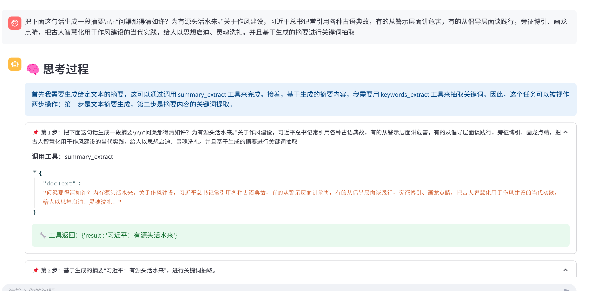
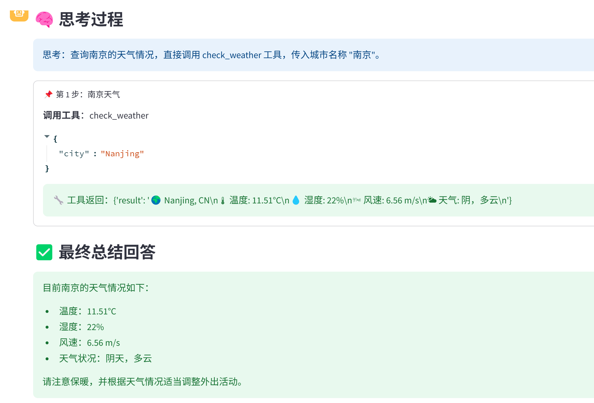

# MCP_Agent
用MCP搭建Agent,实现多步查询策略
本次环境是在docker 容器 内部中执行

Agent搭建策略可以去知乎查看：https://zhuanlan.zhihu.com/p/1894473368180339955

代码执行步骤

**1）服务端启动 **

```
python3 mcp_server.py
```

**2) 客户端启动**

```
 uvicorn mcp_client:app --reload --host 0.0.0.0 --port 18475
```

**3) 在streamlit中问答**

```
streamlit run stremlit_demo.py --server.port=18477
```


**实现效果图：**






**最后欢迎大家提出自己的想法，多多改进！！！**

